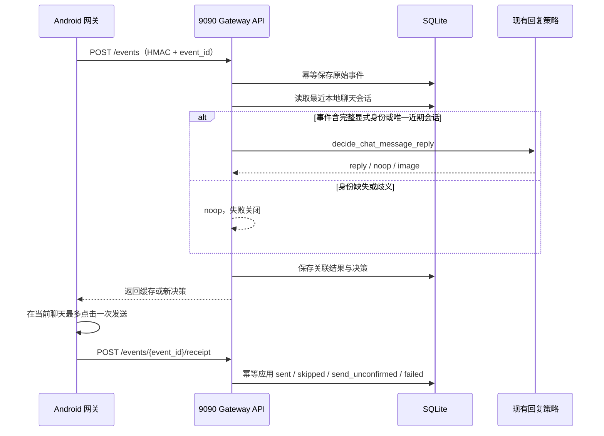

# Android 消息网关后台接入

本服务在 Android 网关模式下只承担业务后台：接收手机侧签名事件、关联真实会话、运行现有
关键词/默认回复/过滤/AI 策略、保存幂等决策和回执。通知发现、打开聊天、输入和点击发送均由
`XianyuMessageAutomation` 完成。

## 业务链路



迁移账号由 `ANDROID_GATEWAY_ACCOUNT_IDS` 声明。后台不会为这些账号启动或恢复旧 WebSocket
自动回复通道；未迁移账号的既有行为不变。

## 配置

在 `.env` 设置：

```dotenv
ANDROID_GATEWAY_SHARED_SECRET=长随机共享密钥
ANDROID_GATEWAY_ACCOUNT_IDS=CookieID1,CookieID2
```

共享密钥必须与 Android 网关一致，不得提交到 Git。修改后重新创建服务：

```bash
docker compose up -d --force-recreate
curl http://127.0.0.1:8090/api/android-gateway/v1/health
```

健康响应应包含 `ok=true`、`enabled=true` 和
`service=android-message-gateway`。账号还必须在“账号管理”中保存有效 Cookie；Cookie 只用于
构造业务策略实例，Android 消息接收与发送不依赖旧 WebSocket。

## 事件协议

`POST /api/android-gateway/v1/events` 请求正文：

```json
{
  "event_id": "SHA-256",
  "device_id": "android-primary",
  "account_id": "后台 Cookie ID",
  "notification_id": "通知指纹",
  "sender_label": "x***3",
  "body": "消息正文",
  "observed_at": "2026-08-10T08:00:00Z",
  "chat_id": "可选真实会话 ID",
  "sender_id": "可选真实买家 ID",
  "item_id": "可选真实商品 ID",
  "correlation_source": "android_activity_intent"
}
```

两个 POST 接口均使用：

```text
X-Gateway-Timestamp: Unix 秒
X-Gateway-Signature: HMAC-SHA256(secret, timestamp + "\n" + raw_body)
```

时间差超过 300 秒、签名错误、账号不在白名单或正文不合法均被拒绝。`event_id` 是幂等主键，
重复请求返回已经保存的决策，不重复运行策略。

## 身份与商品关联

只有以下两类证据可以得到 `correlation_status=matched`：

1. 受 HMAC 保护的事件声明 `correlation_source=android_activity_intent`，且 `chat_id` 与
   `sender_id` 同时非空；`item_id` 可为空；
2. SQLite 本地聊天缓存中存在五分钟内、方向为入站、规范化正文一致、真实
   `chat_id/sender_id/item_id` 上下文唯一的记录。遮罩昵称只能缩小候选范围；同一会话出现
   冲突商品 ID 也视为歧义。

本路径不会调用 `list_newest_conversations`，因此没有旧 WebSocket 消息查询硬依赖。系统也不
再用遮罩昵称生成 `android:<hash>` 身份。无法唯一关联时：

| 场景 | 返回 | 副作用 |
|---|---|---|
| 没有真实候选 | `noop/identity_not_correlated` | 不调用策略、不写聊天记录、不发送 |
| 多个真实候选 | `noop/identity_ambiguous` | 不调用策略、不写聊天记录、不发送 |
| 唯一真实候选 | `matched` | 运行现有策略，保留真实买家/商品上下文 |

这个取舍允许安全漏回，不允许把一个买家的需求或商品上下文串到另一个会话。

## 决策与回执

| 策略结果 | 网关决策 | Android 行为 |
|---|---|---|
| 文本 | `reply` | 精确输入并最多点击一次发送 |
| 无回复或被过滤 | `noop` | 不触碰输入框，回执 `skipped` |
| 图片 | `unsupported` | 当前不发送，回执 `failed` |

Android 随后提交 `sent`、`skipped`、`send_unconfirmed` 或 `failed`。只有
`sent + reply` 才幂等写出站聊天记录并应用“默认回复仅一次”等后续副作用。

## 审计与排障

SQLite 表 `android_gateway_events` 保存 `event_json`、`resolution_json`、决策时间、回执和完成
时间。排障顺序：

1. 健康接口是否 `enabled=true`；
2. `account_id` 是否在白名单且 Cookie 有效；
3. `correlation_status` 与 `decision.reason`；
4. `receipt_outcome` 是否存在；
5. Android 网关日志中的同一 `event_id`。

`not_found/ambiguous` 是主动安全拒绝，不应通过放宽时间窗或允许非唯一候选绕过。手机或闲鱼
版本变化后，应先重新验证 Activity Intent 是否仍提供完整显式身份，再恢复无人值守回复。
